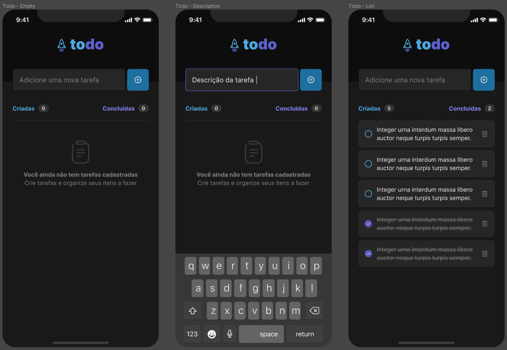

<h1 align="center">
  
</h1>

ToDo List desenvolvida em React Native🚀

<h4 align="center"> 
	🚧  Projeto concluído  🚧
</h4>

  

  
  
  

## 💻 Sobre o projeto

🚀 ToDo - é uma aplicação de controle de tarefas no estilo **to-do list**.

### Features:

- [x] Adicionar uma nova tarefa
- [x] Marcar e desmarcar uma tarefa como concluída
- [x] Remover uma tarefa da listagem

### Conceitos utilizados:

- Estados
- Imutabilidade do estado
- Listas e chaves no React Native
- Propriedades
- Componentização

## 🎨 Layout

O layout da aplicação foi fornecido através do Figma.

## 📲 Telas

  

## 🛠 Tecnologias

Principais tecnologias utilizadas no projeto:

- [Expo](https://expo.io/)
- [Node.js](https://nodejs.org/en/)
- [React](https://pt-br.reactjs.org/)
- [React Native](https://reactnative.dev/)
- [TypeScript](https://www.typescriptlang.org/)

## 🦸 Autor

 

 

## 📝 Licença

Este projeto esta sob a licença [MIT](./LICENSE.md).

Feito com ❤️ por Carlos Junior 👋🏽 [Entre em contato!](https://www.linkedin.com/in/carlosh-rjunior/)

---
